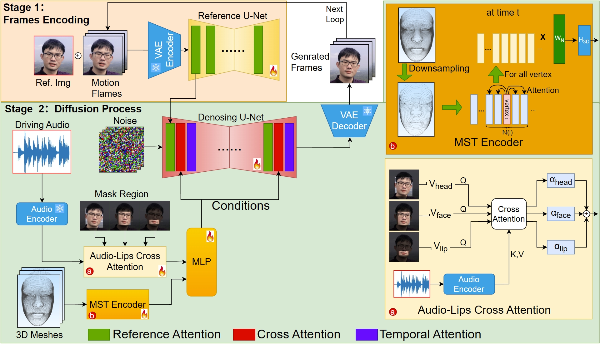

<div align="center">

<h1>APasco: High Fidelity Audio-Driven Portrait Animitation based on Audio-Lip Multi-Head Cross-Attention and 3D Dense Geometric Prior </h1>

<div>
    Jinhan Xie<sup>1</sup>&emsp;
    Kanglin Liu<sup>2</sup>&emsp;
    Zhenyu Bao<sup>1</sup>&emsp;
    Qing Li<sup>2, *</sup>
</div>

<div>
    <sup>1</sup>Peking University&emsp;
    <sup>2</sup>Pengcheng Laboratory
</div>

<div>
    <sup>*</sup>corresponding author
</div>

### [Paper](https://ebooks.iospress.nl/volumearticle/76129?_gl=1*10k29o5*_up*MQ..*_ga*MTYwNjQ4ODkyMC4xNzYzNjI3MTA2*_ga_6N3Q0141SM*czE3NjM2MjcxMDYkbzEkZzEkdDE3NjM2MjcxMzAkajM2JGwwJGgw) | [Project](https://github.com/pcl3dv/APasco?tab=readme-ov-file)  | Code 

</div>



# Abstract
<div>
    Audio-driven portrait animation has achieved significant advances propelled by the development of diffusion models.
Despite remarkable improvements in driving capability and temporal consistency, diffusion model-based methods still suffer from audio-lip misalignment and facial detail loss.
To address them, we present a novel stable diffusion-based approach by conditioning on aligned audio-lip features and 3D dense sequential geometry features. Specifically, we enhance phoneme-lip synchronization by coupling fine-grained local lip features with corresponding audio details with the designed Audio-Lip multi-head Cross-Attention module.
To improve the facial local details,  we derive 3D dense sequential geometry features from  3D dense geometric prior via the developed Mesh Spatio-Temporal Encoder.
Extensive experiments on public benchmarks demonstrate that APasco achieves superior performance in both visual quality and lip-sync accuracy compared to existing approaches.
</div>

<br>

# Results

[https://github.com/user-attachments/assets/09861fcc-18b0-4eae-9d7d-f298f3bdc181](https://github.com/pcl3dv/APasco/blob/main/assets/our.mp4)

[https://github.com/user-attachments/assets/0cdd3f0c-efbf-415b-be80-252fb4a5f121](https://github.com/pcl3dv/APasco/blob/main/assets/our1.mp4)

<br>

## Installation

- System requirement: Ubuntu 20.04/Ubuntu 22.04, Cuda 12.1
- Tested GPUs: A100

Create conda environment:

```bash
  conda create -n apasco python=3.10
  conda activate apasco
```

Install packages with `pip`

```bash
  pip install -r requirements.txt
  pip install .
```

Install ffmpeg :
```bash
  apt-get install ffmpeg
```


## Citation

Cite as below if you find this repository is helpful to your project:
```
@inproceedings{apasco2025,
  title={APasco: High Fidelity Audio-Driven Portrait Animitation based on Audio-Lip Multi-Head Cross-Attention and 3D Dense Geometric Prior},
  author={Xie, Jinhan and Liu, Kanglin and Bao, Zhenyu and Li, Qing},
  booktitle={ECAI},
  pages={3258--3265},
  year={2025}
}
```
